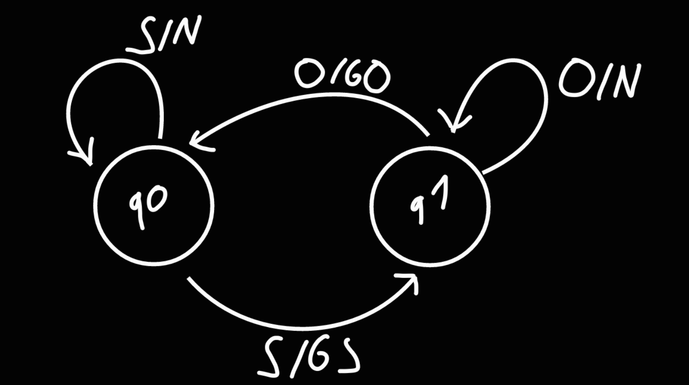
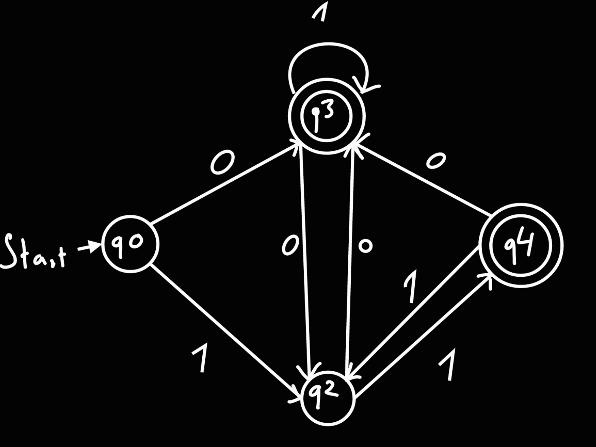
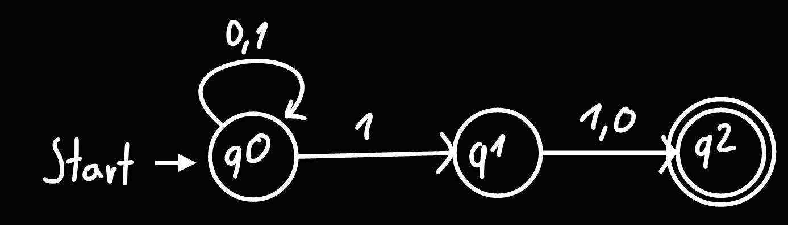
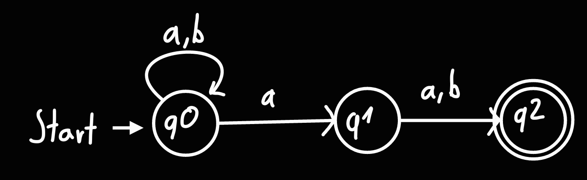
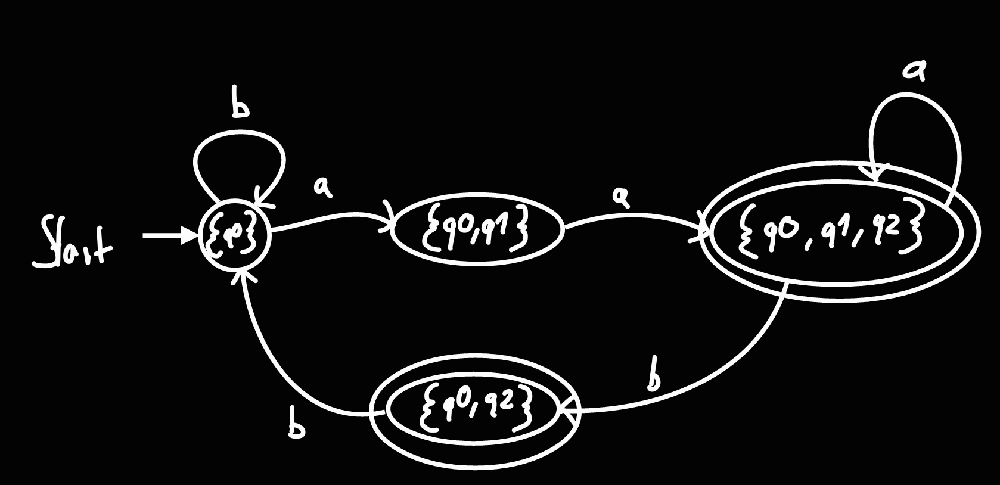
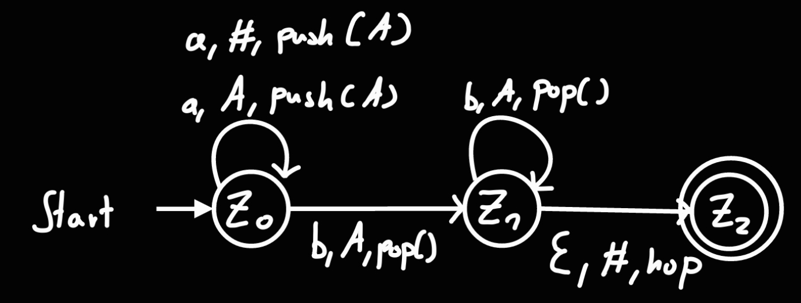
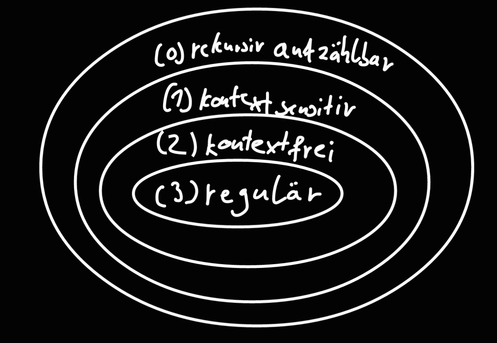

# Automaten und formale Sprachen

# Endliche Automaten
**Anmerkung**: Bei den Graphen werden die Fehlerzustände, der Übersichtlichkeit halber, nicht mitgezeichnet.

## Mealy-Automat

endlich: Eingabealphabet, (Ausgabealphabet), Zustände sind **endlich**

- A = (Q, Σ, δ, Ω, λ,s)
- Q: nichtleere, endliche Menge von Zuständen
- Σ: nichtleeres, endliches Eingabealphabet
- Ω: nichtleeres, endliches Ausgabealphabet
- δ: QxΣ → Q Übergangsfunktion, die jeder Kombination (Zustand, Eingabezeichen) einen Nachfolgezustand zuordnet
- λ: QxΣ → Ω Ausgabefunktion, die jeder Kombination (Zustand, Eingabezeichen) eine Ausgabe zuordnet
- s∈Q: Startzustand

### Beispiel:

- A = (Q, Σ,Ω, δ, λ,s) mit:
    
- Q = {q0, q1}
    
    - q0: zu, q1: offen
- Σ = {O, S}
    
    - O: öffnen, S: schließen
- Ω = {GO, GS, N}
    
    - GO: "Tür wird geöffnet", GS: "Tür wird geschlossen", N: keine Ausgabe
- s = q0
    
- δ:
    
    |     | O   | S   |
    | --- | --- | --- |
    | q0 | q1 | q0 |
    | q1 | q1 | q0 |
    
- λ:
    
    |     | O   | S   |
    | --- | --- | --- |
    | q0 | GO  | N   |
    | q1 | N   | GS  |
    

**oder** als Übergangsgraph:

## Deterministischer endlicher Automat (DEA)

**deterministisch**:
für jeden Zustand gibt es für jedes Eingabezeichen nur genau einen Folgezustand

- A = (Q, Σ, F, δ, s)
- Q: nichtleere, endliche Menge von Zuständen
- Σ: nichtleeres, endliches Eingabealphabet
- F⊆Q Menge der akzeptierenden Zustände
- δ: QxΣ → Q Übergangsfunktion, die jeder Kombination (Zustand, Eingabezeichen) einen Nachfolgezustand zuordnet
- s∈Q Startzustand

**Beispiel**:

- A = (Q, Σ, F, δ, s)
- Q = {q0, q1}
- Σ = {0, 1}
- F = {q0, q3}
- s = q0
- δ =
    
    |     | 0   | 1   |
    | --- | --- | --- |
    | q0 | q3 | q2 |
    | q1 | q3 | q2 |
    | q2 | q3 | q1 |
    | q3 | q2 | q3 |
    

**oder**

### Begriffe

- Alphabet: Ein Alphabet Σ ist eine endliche, nicht leere Menge, die Symbole verschiedener Art enthalten kann.
- Buchstabe: Ein Buchstabe ist ein Element eines Alphabets.
- Wort: Ein Wort über einem Alphabet Σ ist eine endliche Folge von Buchstaben aus Σ.
- vom Automaten akzeptierte Sprache: Die Menge der Wörter, die von einem Automaten akzeptiert werden.

### Verhalten eines DEA

- DEA erhält Eingabewort w=w1...wn
- er startet in q0 und liest in jedem Schritt genau ein Eingabezeichen
- er stoppt, sobald die Eingabe vollständig gelesen wurde
- befindet er sich dann in einem akzeptierenden Zustand, dann gehört das Wort zur Sprache des Automaten L(A)

### Zeigen, dass ein Wort zur Sprache eines DEA gehört (siehe Beispiel-DEA)

Zustandsfolgen für die Eingabewörter:

1.  1011 q0 → q2 → q3 → q3 → q3; Das Wort wird akzeptiert, da q3 ein akzeptierender Zustand ist. (Auf den Pfeilen steht das gelesene Symbol)
2.  111 q0 → q2 → q1 → q2; Das Wort wird nicht akzeptiert, da q2 kein akzeptierender Zustand ist.

### Sprache eines Automaten

Die Sprache eines DEA A besteht aus allen Eingabewörtern, die von A akzeptiert werden.

## Nichtdeterministischer endlicher Automat (NEA)

**nichtdeterministisch**:

für eine Kombination aus Zustand und Eingabezeichen kann es mehrere Folgezustände geben, oder keinen Folgezustand. Dann wird auf die leere Menge abgebildet (Fehlerzustand).

- A = (Q, Σ, F, δ, s)
- Q: nichtleere, endliche Menge von Zuständen
- Σ: nichtleeres, endliches Eingabealphabet
- F⊆Q Menge der akzeptierten Zustände
- δ: QxΣ → P(Q) Übergangsfunktion die jeder Kombination einen Nachfolgezustand zuordnet
- s∈Q Startzustand

P(Q) ist die Potenzmenge von Q, also die Menge aller Teilmengen von Q. Dabei gehört auch die leere Menge ∅ bzw. {} dazu.

**Beispiel**:

- A = (Q, Σ, F, δ, s)
- Q = {q0, q1, q2}
- Σ = {0, 1}
- F = {q2}
- s = q0
- δ:
    
    |     | 0   | 1   |
    | --- | --- | --- |
    | q0 | {q0} | {q0, q1} |
    | q1 | {q2} | {q2} |
    | q2 | {}  | {}  |
    

**oder**

### Hinweise

- ein NEA kann ϵ-Übergänge besitzen, die einen automatischen Übergang zum Folgezustand bedeuten
- ϵ muss nicht explizit zum Eingabealphabet hinzugefügt werden
- ϵ steht für "das leere Wort"

### Verhalten eines NEA

- NEA erhält ein Eingabewort w=w1...wn
- er startet in q0 und liest in jedem Schritt genau ein Eingabezeichen
- es kann mehrere Berechnungen geben, die parallel stattfinden
<!-- To-Do: steckenbleiben ändern -->
- dabei kann der NEA bei einer Berechnung steckenbleiben, falls es für den aktuellen Zustand und das aktuelle Eingabezeichen keinen Folgezustand gibt.
- ein Eingabewort w wird akzeptiert, wenn es mindestens eine Berechnung gibt, die in einem akzeptierenden Zustand endet. Dann gehört das Wort zur Sprache L(A) das Automaten A.

## Zusammenhänge zwischen DEA und NEA

- DEAs und NEAs beschreiben die gleiche Sprachklasse (reguläre Sprachen)
- wesentlicher Unterschied: bei NEA sind auch mehrere Folgezustände bzw. kein Folgezustand mögliche
- der DEA ist ein Spezialfall von einem NEA
- jeder NEA lässt sich mittels Potenzmengenkonstruktion in einen äquivalenten DEA umwandeln

## Potenzmengenkonstruktion

**Idee**
Konstruiere zu NEA einen DEA durch:

- merke im Zustand des DEA, in welchen Zuständen der NEA sein könnte
- Zustände des DEA sind Mengen von Zuständen des NEA

**Beispiel**
<!-- To-Do: Add Übergangstabelle -->

*NEA*

*DEA*

> Jeder Zustand des DEA, der mindestens einen Endzustand vom NEA enthält, wird ein akzeptierender Zustand.

### Algorithmus

- starte mit Menge des Anfangszustands
- solange es unbearbeiteten Zustand S={q1,..., qk} gibt
    - für jedes Eingabezeichen a:
        - für jeden Zustand q1,..., qk
            - bestimme die Nachfolger für die Eingabe a im NEA und füge sie s' hinzu
        - falls es den Zustand s' noch nicht gibt, füge ihn hinzu
        - füge den Übergang von s zu s' hinzu
    - markiere s als bearbeitet

## Kellerautomat (endlicher Automat mit Stack)

- A = (Q, Σ, K, F, δ, s, #)
- Q: nichtleere, endliche Menge von Zuständen
- Σ: nichtleeres, endliches Eingabealphabet
- F⊆Q Menge der akzeptierenden Zustände
- s∈Q Startzustand
- δ: Übergangsfunktion, die jeder Kombination (Zustand, Eingabezeichen (ϵ ist auch möglich, gehört aber nicht zum Eingabealphabet), Kellerzeichen) einen Nachfolgezustand und eine Kelleroperation zuordnet
- #ϵK Anfangssymbol im Keller

**Beispiel**

- A = (Q, Σ, K, F, δ, s, #)
- Q = {z0, z1, z2}
- Σ = {a, b}
- K = {#, A}
- F = {Z2}
- s = Z0
- δ:
	|Zustand|Eingabezeichen|Kellerzeichen|Folgezustand|Kelleroperation|
	|:---|:---|:---|:---|:---|
	|z0|a|#|z0|push(A)|
	|z0|a|A|z0|push(A)|
	|z0|b|A|z1|pop()|
	|z1|b|A|z1|pop()|
	|z1|ϵ|#|z2|nop|

> alle nicht aufgelisteten Übergänge führen in einen Fehlerzustand

**oder**:

## Vergleich der Fähigkeiten der Automatenmodelle
### DEA/NEA
- Beantwortung von Entscheidungsfragen (gehört die Eingabe einer bestimmten Sprache?)
- z.B.: zur Prüfung der syntaktischen Korrektheit von Quellcode (if, for, ..)
- erkennt reguläre Sprachen
### Kellerautomaten (nichtdeterministisch)
- Erkennung beliebig vieler Klammernschachtelnungen
- erkennt kontextfreie Sprachen
- erkennt keine Sprachen der Form L = {anbncn|n>0}

# Formale Sprachen und Grammatiken
## Syntax
Regelsystem zur Kombination elementarer Zeichen zu zusammengesetzten Zeichen, z.B.: Syntaxregeln einer Grammatik, etc.

## Formale Sprache
Eine Formale Sprache L über einem Alphabet Σ ist eine Teilmenge aller möglichen Verknüpfungen des Alphabets

### Zusammenhang zwischen Automaten und Grammatiken
Automaten können die Wörter einer Sprache erkennen. Grammatiken geben die Struktur der Wörter einer Sprache vor. Mittels Produktionsregeln lassen sich Wörter der Sprache erzeugen.

## Formale Grammatik
- G = (N, T, P, S)
- N: nichtleere, endliche Menge von Nichtterminalen
- T: nichtleere, endliche Menge von Terminalen
- P: endliche Menge von Produktionsregeln (Jede Regel bildet eine beliebige Kombination aus T und N, die mindestens ein N enthält, auf eine beliebige Kombination von Terminalen und Nichtterminalen ab.)
- s∈N ist das Startsymbol

**Beispiel**: L = {anbncn|n≥0}

- G = (N, T, S, P)
- N = {S, S', B}
- T = {a, b, c}
- S Startsymbol
- P = {  
	S &rarr; S' | ϵ  
	S' &rarr; aS'Bc | abc  
	cB &rarr; Bc  
	bB &rarr; bb}

### rechtsreguläre Grammatik
Außschließlich Produktionsregeln der Form:
N &rarr; T | TN (Wörter wachsen nach rechts) | ϵ

### linksreguläre Grammatik
Außschließlich Produktionsregeln der Form:
N &rarr; T | NT (Wörter wachsen nach links) | ϵ

### kontextfreie Grammatik
Außschließlich Produktionsregeln der Form:
N &rarr; (NUT)∗ *(alle Kombinationen aus ϵ, N, T)* , also auch N &rarr; ϵ

### Zeigen, dass ein Wort sich aus einer Grammatik ableiten lässt (siehe Grammatik oben)
aabbcc: S &rarr; S' &rarr; aS'Bc &rarr; aabcBc &rarr; aabBcc &rarr; aabbcc (Ableitung des Wortes)

## Hirarchie formaler Sprachen

## reguläre und kontextfreie Sprachen
Die Sprache L ist regulär ⇔ es existiert eine reguläre Grammatik, die L erzeugt ⇔ es existiert ein DEA, der L erkennt

Die Sprache L ist kontextfrei ⇔ es existiert eine kontextfreie Grammatik, die L erzeugt ⇔ es existiert ein Kellerautomat, der L erkennt

## Anwendungen
- Parser: kontextsensitive Grammatik
- Scanner: reguläre Grammatik
