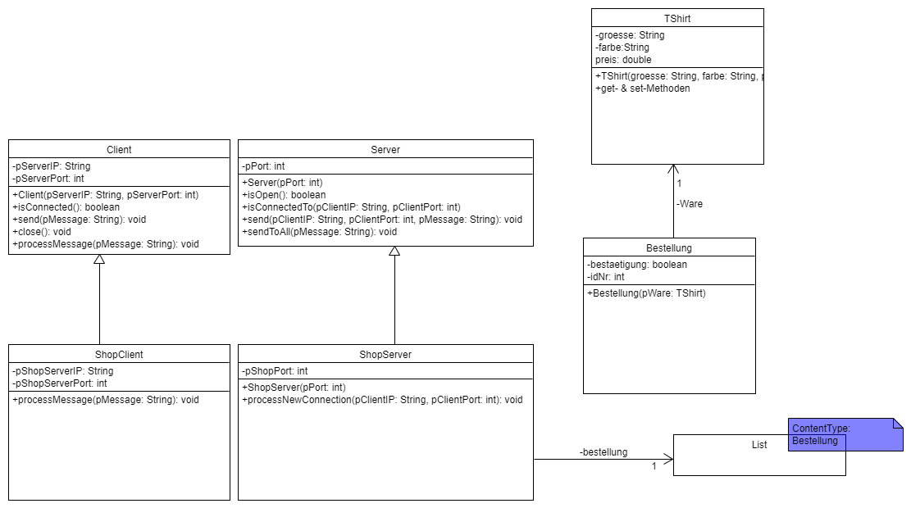

# **Netzwerke**
- Netzwerkprotokoll
- Netzwerktopologien
	- Bus-Topologie
	- Ring-Topologie
	- Stern-Topologie
	- Vermaschte Topologie
- Prüfverfahren
	- Paritätsbit
	- Prüfsumme
	- XOR-Prüfsumme
- TCP/IP-Schichtenmodell
- Kommunikation zwischen Client und Server
	- Modellierung
	- Implementation
- Grundprinzipien des Datenschutz
- Schutzziele in der Informationssicherheit
- Stellungnahme im Fach Informatik
	- [These](#these)
	- [Argumente](#argumente)
	- [Positionierung](#positionierung)
# Netzwerkprotokoll
**Definition**:  
Ein Netzwerkprotokoll umfasst einheitliche Kommunikationsregeln welches den Austausch von Paketen zwischen Endpunkten definiert. Alle möglichen Anfragen und Antworten sind durch eine Semantik definiert.

# Netzwerktopologien
  
**Quelle**: https://upload.wikimedia.org/wikipedia/commons/thumb/5/55/NetworkTopologies_%28de%29.svg/640px-NetworkTopologies_%28de%29.svg.png
## Bus-Topologie
**Beschreibung**:  
Alle Rechner sind direkt mit dem Übertragungsmedium verbunden, dem sogenannten BUS. Dies führt dazu, dass nur ein Teilnehmer zu einem Zeitpunkt Daten versenden kann.
|Vorteile|Nachteile|
|:-------------:|:-------------:|
|Einfache Installation|Der Ausfall eines Kabels führt zum Ausfall des gesamten Netzwerks|
|Kurze Leitungen|Besitzt einen hohen Organisationsaufwand wegen der eingeschränkten Sendemöglichkeiten|

## Ring-Topologie
**Beschreibung**:  
Jeder Computer im Netzwerk ist mit genau zwei weiteren verbunden. Die Daten werden vom Sender über die anderen Computer an den Empfänger geleitet.
|Vorteile|Nachteile|
|:-------------:|:-------------:|
|Verteilte Steuerung mit gleichberechtigten Teilnehmern|Es gibt nur einen Alternativweg bei einer Störung|
|Große Netzwerkausdehnung wegen der Signalverstärkung der einzelnen Computer möglich|Hoher Verkabelungsaufwand|

## Stern-Topologie
**Beschreibung**:  
Jeder Computer ist mit nur einem Zentralen verbunden. Alle Daten werden über diesen verteilt.
|Vorteile|Nachteile|
|:-------------:|:-------------:|
|Einfache Erweiterung des Netzwerks wegen der geringen Kabellänge|Hoher Verkabelungsaufwand|
|Geringe Störungsanfälligkeit beim Ausfall eines Computers, welcher nicht die Zentrale ist|Kompletter Netzausfall bei einer Störung des zentralen Rechners|

## Vermaschte Topologie
**Beschreibung**:  
Jeder Computer im Netzwerk ist mit mindestens einem weiteren verbunden. Die Daten haben meistens mehrere Routen vom Sender zum Empfänger. Wenn alle Rechner mit allen anderen verbunden sind heißt diese vollvermascht.
|Vorteile|Nachteile|
|:-------------:|:-------------:|
|Hoch Ausfallsicherheit durch alternative Wege von einem Rechner zum anderen|Aufwändige Organisation für Wegbestimmung der Daten notwendig|
||Die Verkabelung ist sehr hochwertig und somit teuer|

# Prüfverfahren
## Paritätsbit
**Definition**:  
An die Bitfolge wird ein Prüfbit angehängt, durch das die Anzahl der Einsen in der Bitfolge gerade wird.

		Beispiel:
		Bitfolge: 10010111
		Berechnung: Anzahl der Einsen ist ungerade
		Prüfbit: 1

## Prüfsumme
**Definition**:  
Es werden alle Bits der Bitfolge addiert. Die Summe wird modulo n gerechnet, wobei durch n die Länge der Prüfsumme bestimmt wird.

		Beispiel:
		Bitfolge: 10110111
		Berechnung: (1+0+1+1+0+1+1+1)mod4 = 1 r 2
		Prüfsumme: 10  (Rest 2)

## XOR-Prüfsumme
**Definition**:  
Mehrere gleich lange Teile einer Bitfolge werden XOR-verknüpft. Es entsteht eine Prüfsumme, die die gleiche Länge wie die einzelnen Bitfolgen hat.

		Beispiel:
		Bitfolge: 10110011
		Berechnung:		10110011  
				XOR	01101000
		Prüfsumme:		11011011
# TCP/IP-Schichtenmodell
## Anwendungsschicht
- Stellt Dienste für die jeweilige Anwendung bereit
- Übersetzt die Daten in eine Systemunabhängige Form
- Verbindet jeweils die an einer Sitzung beteiligten Anwendungen

## Transportschicht
- Stellt eine zuverlässige Verbindung zwischen den Computern her

## Internetschicht
- Die Daten werden vom Sender zum Empfänger über das Netzwerk verschickt

## Netzzugangsschicht
- Stellt eine zuverlässige physikalische Verbindung her
- Überträgt die Daten mithilfe von physischen Signalen (wie Licht oder elektrischem Strom)

# Kommunikation zwischen Client und Server
## Modellierung
**Allgemein**:
|Nr.|Client an Server|Server an Client|
|:-------------:|:-------------:|:-------------:|
|1|Anfrage|Reaktion auf diese Anfrage (Was geschieht bei dieser Anfrage)|
|2|Message|Was passiert beim Erhalt der Message (bei variablen, was für fälle gibt es)|
|...|...|...|

**Beispiel**:
|Nr.|Client an Server|Server an Client|
|:-------------|:-------------|:-------------|
|1|```ANMELDUNG```|Begrüßung, Aufforderung zur Wahl der Größe und Farbe des T-Shirts|
|2|```HOODIE: <Groesse>:<Farbe>```|Größe und Farbe werden bestätigt,<br> Preis wird übermittelt,<br> Bestätigung wird angefordert,<br> Größe oder Farbe ist falsch,<br> Aufforderung für eine korrekte Eingabe|
|3|```BESTAETIGUNG:<Wahl>```|<ul><li>Bei ```<Wahl>``` = ja (gleich) wird dem Kunden gedankt</li><li>Bei ```<Wahl>``` = (gleich) nein wird der Kunde abgemeldet</li><li>Bei ```<Wahl>``` != (ungleich) (ja oder nein), Aufforderung für eine korrekte Eingabe</li>|
|4|```ABMELDEN```|Der Kunde wird verabschiedet|
|5|Sonstige Nachricht|Unbekannte Anweisung, Aufforderung für eine korrekte Eingabe|

**Kommunikation zwischen Client und Server**:
|Client sendet||Server sendet|
|:-------------|:-------------|:-------------|
|Anfrage|&rarr;||
||&larr;|Antwort|
|Anfrage|&rarr;||
||&larr;|...|

## Implementation
**Um durch die Abiturklassen eine Verbindung auf zu bauen, werden einige Methoden und Vererbungen benötigt.**


**Der Client muss hier bei diese Methode implementieren:**
``+ProcessMessage(pMessage: String): void``
Hierbei ist auch wichtig, dass die jeweilige Client Klasse von der Abiturklasse „Client“ erbt (extends). Hierbei muss auch darauf geachtet werden, dass ein Client Objekt durch super mit einer Server IP sowie Port erstellt wird.

**Der Server muss hierbei folgende Methoden Implementieren:**
```
+processNewConnection(pClientIP: String, pClientPort: int): void
+processMessage(pClientIP: String, pClientPort: int, pMessage: String): void
+processClosingConnection(pClientIP: String, pClientPort: int): void
```
Es ist darauf zu achten, dass die implementierende Klasse von der Abiturklasse „Server“ erbt (extends), sowie durch einen „super()“ Aufruf eine „Server“ Klasse erstellt.
**Beispiel für eine Server-Implementierung**

```java
public class ShopServer extends Server
{
	public ShopServer(int pPortnummer)
	{
		super(pPortnummer);
	}
	public void processNewConnection(String pClientIP, int pClientPort){
	}
	public void processMessage(String pClientIP, int pClientPort, String pMessage){
	}
	public void processClosingConnection(String pClientIP, int pClientPort){
	}
}
```

# Grundprinzipien des Datenschutz

1. Verbot mit Erlaubnisvorbehalt
	- Die Verarbeitung, d. h. zum Beispiel die Erhebung, Speicherung, Weitergabe oder allgemeine Verwendung personenbezogener Daten ist grundsätzlich verboten – es sei denn, die betroffene Person hat der Verarbeitung für einen konkreten Zweck zugestimmt oder es gibt eine explizite gesetzliche Regelung, die eine Verarbeitung für einen konkreten Zweck erlaubt. 
2. Datenminimierung 
	- Die Verarbeitung personenbezogener Daten ist an dem Ziel auszurichten, so wenig personenbezogene Daten wie möglich zu verarbeiten. Insbesondere sind personenbezogene Daten nach Möglichkeit zu anonymisieren bzw. zu pseudonymisieren. Sie sind zu löschen, sobald sie nicht mehr benötigt werden. 
3. Zweckbindung 
	- Personenbezogene Daten dürfen nur zu einem konkreten Zweck erhoben und verarbeitet werden. Eine weitergehende Verarbeitung zu einem anderen Zweck ist in der Regel nicht erlaubt. 
4. Transparenz 
	- Werden personenbezogene Daten verarbeitet, so ist die betroffene Person, sofern sie nicht bereits auf andere Weise Kenntnis erlangt hat, darüber zu informieren. Dazu gehören unter anderem Informationen zum Zweck der Verarbeitung, zur verarbeitenden Stelle bzw. Institution und zu der Frage, wie lange die Daten gespeichert werden. Ausnahmen gibt es z. B. im Bereich der Strafverfolgung. 
5. Erforderlichkeit 
	- Personenbezogene Daten dürfen nur dann verarbeitet werden, wenn sie für den Zweck, zu dem sie verarbeitet werden, wirklich benötigt werden oder die Aufgabenerfüllung der verantwortlichen Stelle zumindest erheblich erleichtert wird.

# Schutzziele in der Informationssicherheit
Es gibt 7 Schutzziele in der Informationssicherheit. Diese sind:
- [Vertraulichkeit](#vertraulichkeit)
- [Integrität](#integrität)
- [Verfügbarkeit](#verfügbarkeit)
- [Authentizität](#authentizität)
- [Nichtabstreitbarkeit](#nichtabstreitbarkeit)
- [Zurechenbarkeit](#zurechenbarkeit)
- [Privatsphäre](#privatsphäre)

## Vertraulichkeit
Die Information einer Nachricht ist nur den befugten Personen zugänglich.

## Integrität
Der Inahlt der Nachricht kann entweder nicht bearbeitet werden oder nicht unbemerkt bearbeitet werden.

## Verfügbarkeit
Ein Dienst muss zur vereinbarten Zeit verfügbar sein. Die Verfügbarkeit setzt sich aus der eigentlichen Aktivzeit geteilt durch die vereinbarte Zeit zusammen.

## Authentizität
Beinhaltet, dass der aktuelle Kommunikationsparnter auch der gewollte  bzw. richtige Kommunikationspartner ist. Man kann dies auch als Identitätsnachweis nennen.

## Nichtabstreitbarkeit
Der Urheber einer Nachricht kann dies nicht gegenüber anderer Personen abstreiten.

## Zurechenbarkeit
Eine Nachricht soll einem Nutzer zugewiesen werden können.

## Privatsphäre
Die privaten Nachrichten von Nutzern sollen nicht veröffentlicht werden. Dabei gibt es die Anonymität wo der Nutzer nicht bekannt ist und die Pseudonymität wo ein Nutzer identifiziert werden kann aber nicht mit einer echten Person in verbindung gebracht werden kann.


**Quelle**: https://www.kryptowissen.de/schutzziele.php

# Stellungnahme im Fach Informatik
Eine Stellungsnahme besteht aus drei Teilen. Die These, die Argumente und als letztes die Positionierung.

## These
Die These ist eine Behauptung zu der man Stellung nehmen soll. Je nach Aufgabenstellung kann man seine eigenen These entwickeln oder man bekommt eine These.

## Argumente
Bei den Argumenten sammelt man verschiedene die für die These oder gegen sie sprechen. Dabei kann man verschiedene Argumentationsverläufe verwenden, wie zum Beispiel:
- Ping-Pong: Pro und Contra Argumente folgen einander im Argumentationsverlauf.
- Sanduhr: Die Argumente für eine Seite werden von stärksten zum schwächsten aufgeführt. Danach werden die Gegenargumente vom schwächsten zum stärksten Argument aufgeführt. Somit ergibt sich die Form einer Sanduhr.

## Positionierung
Hier wägt man die aufgelisteten pro und contra Argumente gegeneinander ab und kommt zu einer begrüdeten Position, die man als Autor explizit aufschreiben sollte.
