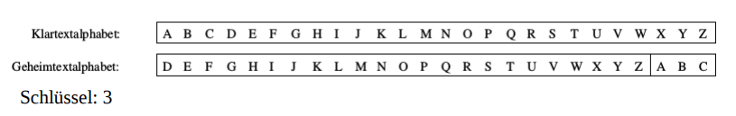
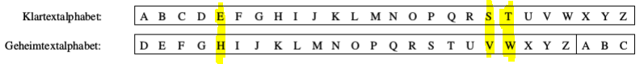
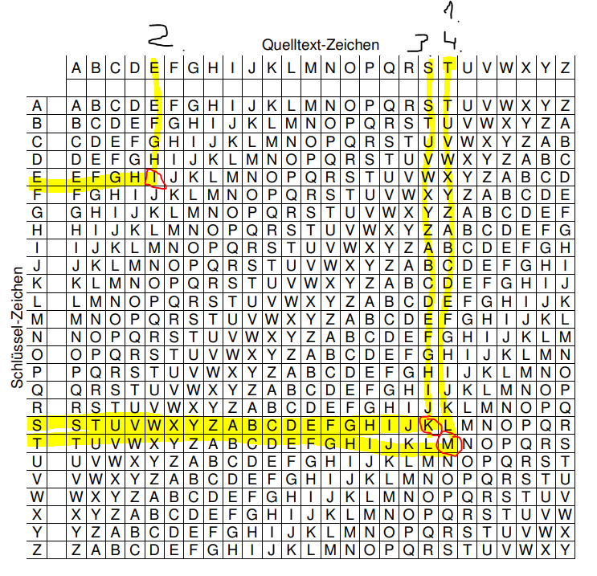
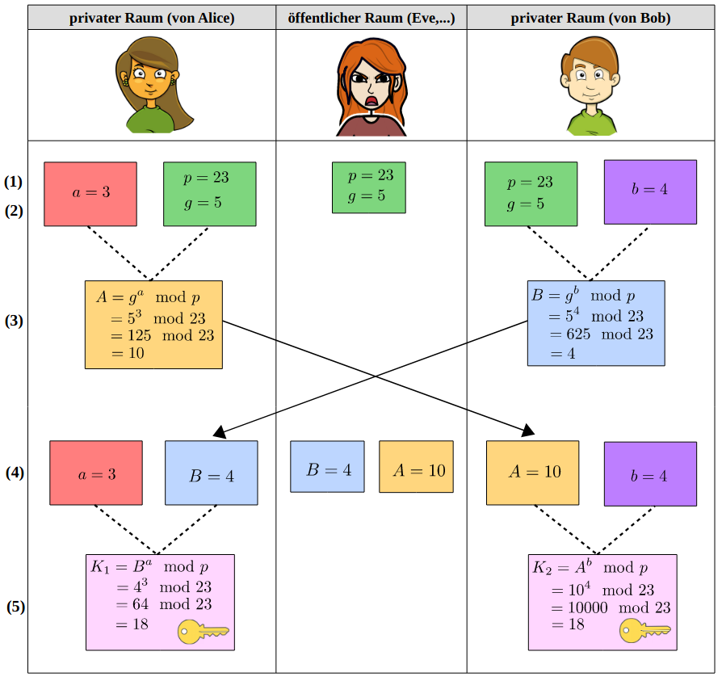

# Verschlüsselung

# Grunglagen Kryptographie

## Grundbegriffe

| Begriff | Definition |
| --- | --- |
| Klartext (Plaintext) | Beschreibt eine unverschlüsselte Nachricht |
| Klartextalphabet | Zeichen, aus denen der Klartext bestehen kann |
| Geheimtext (Ciphertext) | Beschreibt eine verschlüsselte Nachricht |
| Geheimtextalphabet | Zeichen, aus denen der Geheimtext bestehen kann |
| Verschlüsseln (Chiffrieren) | Vorgang, um einen Klartext durch ein Verfahren in einen Geheimtext umzuwandeln |
| Entschlüsseln (Dechiffriern) | Vorgang, um einen Geheimtext in einen Klartext umzuwandeln |
| Schlüssel | nformation oder Algorithmus, welcher angibt, wie das Verschlüsselungsverfahren in einer Situation angewendet werden soll. |
| Kryptographie | Die Wissenschaft der Entwicklung von Verschlüsselungsvervahren, sowie der Ver- und Entschlüsselung von Daten |
| Kryptoanalyse | Die Wissenschaft des Brechens von Verschlüsselungsverfahren |
| Kryptologie | Zusammenfassung von Kryptoanalyse und Kryptographie |

# Mathematische Grundlagen der Kryptografie

## Primzahlen

Eine Primzahl ist eine Zahl, die größer als eins ist und nur durch sich selbst und eins teilbar ist.

## Primfaktorzerlegung

Jede natürliche Zahl die größer als eins ist und selbst keine Primzahl ist, lässt sich als ein Produkt von mindestens zwei Primzahlen schreiben.

Beispiel:

> 60= 2*30 = 2*2*15= 2²*3*5

## Teilbarkeit

Eine ganze Zahl a ist durch eine andere ganze Zahl b teilbar, wenn bei der Division a:b kein Rest entsteht.

Beispiel:

> Teilbar: 8:4 = 2
> Nicht Teilbar (mit Rest): 8:7= 1 r 1

*Teiler einer Zahl: ggT (größter gemeinsamer Teiler)*

Beispiel:

> gemeinsame Teiler von 12 und 18: 1,2,3,6
> größter gemeinsame Teiler von 12 und 18: ggT(12,18) = 6

## Die Modulo-Funktion

- a mod m ist der Rest, den eine Zahl bei der Division durch eine Zahl lässt. Es gibt also eine Zahl k mit a=k*m+r
- Der Rest r kann also nur die Werte 0 bis m-1 annehmen.

Beispiel:

> 19 mod 5 = 4, da 19:5 = 3 (Rest 4)

## Kongruenzen

Sei m > 1 eine natürliche Zahl. Lassen zwei ganze Zahlen a und b bei der Division durch m den gleichen Rest, dann nennt man a und b kongurent modulo m und schreibt dafür kurz: a≡b mod m

Beispiel:
> 30≡4mod13, da 30mod13=4 und 4mod13=4

## Rechengesetze für Modulo-Funktionen

- (x+y) mod m = ((x mod m) + (y mod m)) mod m
- (x\*y) mod m = ((y mod m) \* (y mod m)) mod m

Beispiel:

> 23 mod 5 = (12+11) mod 5 = ((12 mod 5) + (11 mod 5)) mod 5 = (2+1) mod 5 = 5 mod 5

# Verschlüsselung
## Symmetrische Verschlüsselung

Die symmetrische Verschlüsselung benutzt nur einen Schlüssel, um die Nachricht zu ver- und entschlüsseln. Dies hat den Nachteil, dass dieser Schlüssel geheim gehalten werden muss und deshalb über ein sicheres Übertragungsmedium mitgeteilt werden muss. Es gibt aber auch Verfahren, mit denen man einen symmetrischen Schlüssel über eine nicht sichere Verbindung austauschen kann. Dies ist der Diffie-Hellman-Schlüsselaustausch.

## Caesar-Verschlüsselung

Das Caesar-Verfahren ist ein unsicheres, symmetrisches Verschlüsselungsverfahren. Bei der Verschlüsselung wird das Alphabet um einen festen Schlüssel verschoben, wobei dieser eine Zahl von 1-25 an nehmen kann. Das Verfahren ist unsicher, da es nur 25 verschiedene Schlüssel gibt, wodurch alle möglichen Kombinationen schnell ausprobiert werden können.

Beispiel:



Verschlüsseln wir eine Nachricht:

→ "TEST"



Wir erhalten:  
T → W  
E → H  
S → V  
T → W  

Verschlüsselt: WHVW

Beim Entschlüsseln wird dieser Vorgang einfach rückwärts durchgeführt.

## VIGENÈRE-Verschlüsselung

Das VIGENÈRE-Verfahren ist ein unsicheres Verschlüsselungsverfahren, welches durch ein Schlüsselwort den Quellbuchstaben durch ein sich veränderndes Alphabet ein anderen Wert zu ordnet.

Beispiel:

- Nachricht: Test
- Schlüsselwort: Test

Im Vigenere Quadrat:



„Test“ mit dem Schlüssel „Test“ ergibt: MIKM

Beim Entschlüsseln wird dieses Verfahren einfach rückwärts angewandt.

## Der Kasiski-Test

- Wird benutzt, um die Länge des Schlüsselworts bei der Vigenere Verschlüsselung zu bestimmen
- Nachdem die Länge bestimmt wurde, können einfach wie auch beim Caesar verfahren alle Möglichkeiten durchprobiert werden.

Beispiel:

> AXTRX TRYLC TYSZO EMLAF QWEUZ HRKDP NRVWM WXRPI
> JTRHN IKMYF WLQIE NNOXW OTVXB NEXRK AFYHW KXAXF
> QYAWD PKKWB WLZOF XRLSN AAWUX WTURH RFWLL WWKYF
> WGAXG LPCTG ZXWOX RPIYB CSMYF WIKPA DHYBC SMYFW
> KGMTE EUWAD LHSLP AVHFK HMWLK

Dieser Text wurde mit dem Wort „ALTESTESTAMENT“ verschlüsselt. Wir versuchen nun die Schlüssellänge heraus zu finden. Dazu müssen wir zunächst wiederkehrende Zeichenketten von einer Mindestlänge von 3 finden.

> A```XTR``` ```X TR```YLC TYSZO EMLAF QWEUZ HRKDP NRVWM W```XRPI```
> JTRHN IKM```YF W```LQIE NNOXW OTVXB NEXRK AFYHW KXAXF
> QYAWD PKKWB WLZOF XRLSN AAWUX WTURH RFWLL WWK```YF
> W```GAXG LPCTG ZXWO```X RPI``` ```YB CSMYF W```IKPA DH```YBC SMYFW```
> KGMTE EUWAD LHSLP AVHFK HMWLK

- XTR:         Abstand 3
- XRPI:        Abstand 98
- YFW:         Abstand 70
- YBCSMYFW:    Abstand 14

Zuletzt zerlegen wir die Zahlen noch in ihre Primfaktoren:

3   =      3
98   = 2 ×         7 × 7
70   = 2 ×     5 × 7
14   = 2 ×         7

Nun suchen wir ein gemeinsames Vielfaches der Zahlen. Hierbei fällt die Zahl 14 auf:

2 * 7 = 14

**Dieses Vielfache passt zu allen Zahlen. Eventuell war der Abstand von 3 nur ein zufälliges Auftreten. 14 stimmt in diesem Fall.**

## Diffie-Hellman-Verfahren
Das Diffie-Hellman-Verfahren wird genutzt, um einen symmetrischen Schlüssel über eine ungesicherte Verbindung auszutauschen.

Beispiel:
<details>
	<summary>Diffie-Hellman-Verfahren Veranschaulichung DE</summary>
<br>

  
**Quelle**: Wikimedia Commons, Public Domain &rarr; https://commons.wikimedia.org/wiki/File:Diffie-Hellman_Key_Exchange_(de).svg
</details>

<details open>
<summary>Diffie-Hellman-Verfahren Veranschaulichung EN</summary>
<br>

  
**Quelle**: Lorddota, Wikimedia Commons, Creative Commons Attribution-Share Alike 4.0 &rarr; https://commons.wikimedia.org/wiki/File:Diffie-Hellman_Key_Exchange-modified.png
</details>

  
**Quelle**: https://openclipart.org

## Asymmetrische Verschlüsselung
Die asymmetrische Verschlüsselung basiert, anders als die symmetrische Verschlüsselung, auf zwei verschiedenen Schlüsseln. Diese sind der öffentliche und der private Schlüssel. Der öffentliche Schlüssel wird an die Kommunikationspartner verschickt. Diese verschlüsseln ihre Nachrichten mit diesem öffentlichem Schlüssel. Wenn eine Nachricht (oder Datei) mit einem öffentlichen Schlüssel verschlüsselt wurde, kann sie nur mithilfe des privaten Schlüssels entschlüsselt werden. Der private Schlüssel soll privat gehalten werden, weshalb er (idealerweise) auf dem Gerät bleiben sollte. Eine Kommunikation zwischen zwei Kommunikationspartnern könnte wie folgt ablaufen:

1. Partner0 sendet Partner1 seinen öffentlichen Schlüssel
2. Partner1 verschlüsselt seine Nachricht an Partner0 mit dessen öffentlichen Schlüssel den er von ihm bekommen hat
3. Partner0 erhält die Nachricht von Partner1 und entschlüsselt diese mit seinem privaten Schlüssel.
4. Nachdem Partner0 die Nachricht enthalten hat, kann er noch eine Nachricht als Bestätigung schicken. Diese wird mit dem private Schlüssel verschlüsselt und kann mit dem öffentlichen Schlüssel entschlüsselt werden. Somit bestätigt Partner0, dass er wirklich er selbst ist da er den privaten Schlüssel besitzt. Dies nennt man auch Signatur und sie enthält keine sensitiven Daten.

# RSA-Verschlüsselung
privater Schlüssel: (d, N)
>Beispiel:	(11, 14)

öffentlicher Schlüssel: (e, N)
>Beispiel: (5, 14)

Nachricht: m
>Beispiel: c (3)

## Verschlüsseln
m^e (als Zahl) mod N

Beispiel:
> 3 mod 14 = 5 (e)
> Cyphertext  (c) = 5 (e)

## Entschlüsseln
c^d (als Zahl) mod N

Beispiel:
> 5 mod 15 = 3 (c)

## RSA-Schlüsselgeneration
Um eine Nachricht mit dem RSA-Verfahren zu verschlüsseln braucht man einen privaten und einen öffentlichen Schlüssel. Dieser wird generell in 5 Schritten erzeugt.

- Schritt 1 – p und q  
Wähle zwei zufällige möglichst große Primzahlen aus. Diese nennen wir p und q

- Schritt 2 – N  
Nun ermittlen wir die Zahl N, indem wir p mit q multiplizieren.

- Schritt 3 – r  
Als nächstes wird nun r mit ermittelt, indem p und q jeweils mit 1 subtrahiert werden und danach multipliziert werden.

- Schritt 4 – e  
Wähle eine zufällige Zahl e, die keinen gemeinsamen Teiler mit r hat.

- Schritt 5 – d  
Als letzes wird die Zahl d so gewählt, dass e*d mod r = 1 gilt.

Nun haben wir alle nötigen Komponenten, um unsere privaten und öffentlichen Schlüssel zu erstellen.

Diese sehen wie folgt aus:

(**e**, **N**) &rarr; öffentlicher Schlüssel
(**d**, **N**) &rarr; privater Schlüssel
